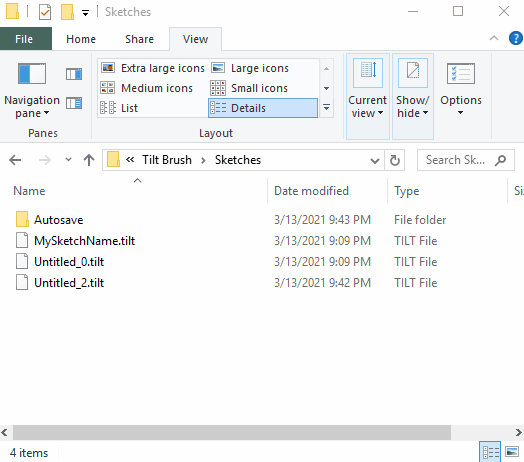

# Fashion Critique Upload Instructions for Google Drive and Icosa Gallery

## Table of Contents

1. Save the garment sketch (Tilt) file to the computer
2. Save the garment 3D model (GLB) file to the computer
3. Upload the garment sketch (Tilt) and 3D model (GLB) files to Google Drive
4. Upload the garment 3D model (GLB) file to Icosa Gallery
5. Preview the GLB file in Icosa Gallery
6. More info

___

## Save the garment sketch (Tilt) file to the computer

Save the sketch by pressing the icon above the Open Brush logo.

Open the sketch's file location: 

1. Open the Sketches panel by choosing the Open Brush icon.
2. Make a note of the sketch name by hovering over the desired sketch.
3. Show more options for the desired sketch by selecting the three dots.
4. Choose "Reveal on desktop" (the folder icon).
5. Open the folder with the sketch name. 
6. Copy the file called `<SketchName>.tilt`.

Alternatively, open `Documents/Open Brush/Sketches` to view the sketches.

## Save the garment 3D model (GLB) file to the computer

1. Enable Advanced Mode by toggling the icon to the lower left of the Open Brush logo.
2. Open the More Options... panel by selecting the three dots to the lower right of the Open Brush logo.
3. Open the Labs panel by selecting the flask icon.
4. Export a model by pressing the monitor icon. 

Open `Documents/Open Brush/Exports/SketchNameHere/glb/` to view the GLB file.

Open `Documents/Open Brush/Exports/SketchNameHere/fbx/` to view the FBX file.

Preview your model by going to https://sandbox.babylonjs.com/ and dragging the GLB file onto the page. 

NOTE: GLB files generated with Open Brush need post-processing to display properly, so colors and animations may look incorrect in the preview on the link above. Also, Windows 3D Viewer cannot read Open Brush-generated GLB files, unfortunately. 

## Upload the garment sketch (Tilt) and 3D model (GLB) files to Google Drive

1. Log into Google Drive
2. Open the folder `ARTS 221 <Semester>`
3. Put your Tilt file into the `Sketches (Tilt)` folder
4. Put your GLB file into the `Models (GLB)` folder

## Upload the garment 3D model (GLB) file to Icosa Gallery

1. Go to https://icosa.gallery
2. Press `Login/Register` in the upper right.
3. Sign in with the provided fashion illustration account credentials.
4. Choose `My Uploads` (the grid icon in the left sidebar).
5. Press `Upload`.
6. Drag-and-drop the GLB file from the computer to the `Choose File` button.
7. Or press `Choose File` and select the GLB file.
8. Wait for the upload to finish, then refresh the page. It should automatically take you to `Manage Uploads`.
9. Scroll to the bottom of `Manage Uploads` and select the last item, which should be your garment.
10. Preview the garment and make sure it looks correct.

___

## Table of Contents: More Info
5. Resume editing an existing sketch (Tilt) file
5. Save any existing sketches before making a new one
6. About signing into a Poly account and Google Drive Backup
7. Understand the difference between sketch files and model files
8. Helpful Links

___

## Resume editing an existing sketch (Tilt) file

1. Download the Tilt file from Google Drive.
2. Place the Tilt file inside `Documents\Open Brush\Sketches`
3. Open `Open Brush`
4. Open the sketchbook (the Open Brush logo)
5. Select your sketch.

## Save any existing sketches before making a new one

Open Tilt Brush. Check to make sure someone else’s sketch isn’t already open. If it is, save it just in case:

1. Make sure the sketch is saved by looking in the Sketches panel.
2. Clear the sketch by pressing the trash icon near the Tilt Brush logo.
3. Draw a new sketch.
4. Save the new sketch by pressing the save icon near the Tilt Brush logo.

## About signing into a Poly account and Google Drive Backup

Unfortunately, these are no longer supported by Google.

Icosa Gallery is working on replacements within Open Brush, but they are not ready yet.

## Understand the difference between sketch files and model files

Sketch files are TILT files, and save all data associated with your sketch, including the environment and image references. They are like PSD files, or Word documents. They can only be opened by Tilt Brush or custom apps built with Tilt Brush tools. If you want to edit your sketch in the future, you should keep this file. 

Model files are GLB or FBX files, and save only the brush strokes from your sketch. They are like PNG files. They can be imported into other viewer apps. If you want to just view the model made from your sketch, you should use this file.  The easiest way to turn a sketch into a model file is to use Tilt Brush, so it is best to export a model file while you are in the app. 

## Helpful Links

The Open Brush project does not currently have documentation, but since it is a fork of Tilt Brush, you can refer to the Tilt Brush documentation.

[Tilt Brush Help > Painting with Tilt Brush](https://support.google.com/tiltbrush/answer/6389712?hl=en&ref_topic=7074683)

[Tilt Brush Help > Saving and sharing your Tilt Brush sketches > Saving a Sketch](https://support.google.com/tiltbrush/answer/6389651?hl=en&ref_topic=7074683#gbwa:~:text=Saving%20a%20sketch,to%20your%20computer%20at%20Documents%2FTilt%20Brush%2FSketches.)

[Tilt Brush Help > Saving and sharing your Tilt Brush sketches > Export your sketch file to .fbx](https://support.google.com/tiltbrush/answer/6389651?hl=en&ref_topic=7074683#gbwa:~:text=Export%20your%20sketch%20file%20to%20.fbx,will%20be%20saved%20to%20Tilt%20Brush%2Fexports.)
___

## Footnotes

