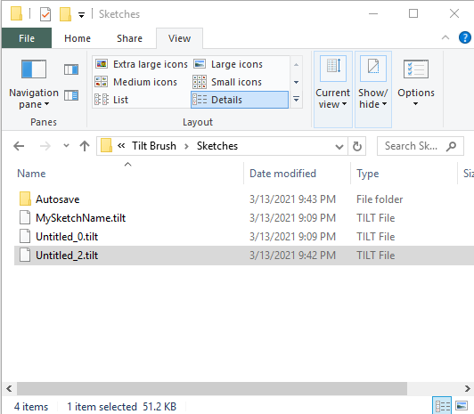
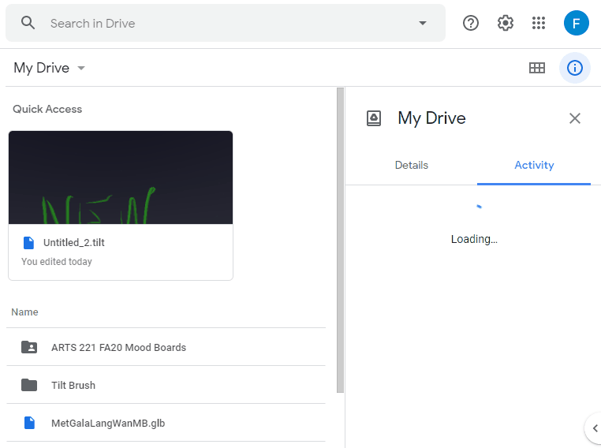
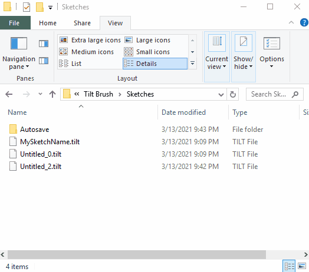

# design-critique
Design critique domain module for the Komodo platform

# Tilt Brush Instructions 
For PC VR, which includes Oculus Rift (S) and Oculus Link (Quest plugged into a PC)

***

## Checklist
1. Save your sketch (TILT file) to computer
2. Ensure your sketch and model are backed up in Google Drive
3. Export your model (GLB file) to computer
4. Upload your sketch to Poly

For more info, see "More Info" below.

## 1. Save your sketch (TILT file) to the computer

Save the sketch by pressing the icon above the Tilt Brush logo.

Open the sketch's file location: 

1. Open the Sketches panel by choosing the Tilt Brush icon.
2. Make a note of the sketch name by hovering over the desired sketch.
3. Show more options for the desired sketch by selecting the three dots.
4. Choose "Reveal on desktop" (the folder icon).
5. Open the folder with the sketch name. 
6. Copy the file called `<SketchName>.tilt`.

Alternatively, open `Documents/Tilt Brush/Sketches` to view the sketches.

## 2. Ensure your sketch and model are backed up to Google Drive

1. Open Accounts by selecting the profile icon below the Tilt Brush logo. 
2. Open the Google Drive panel by choosing "Drive Backup".
3. Open the Google Drive folder in a browser by selecting "View on Drive".
4. Find the sketch by searching Google Drive for files modified today. 

Alternatively, open `Tilt Brush/Sketches/` to locate the sketches and `Tilt Brush/Exports/SketchNameHere/glb/` or `TiltBrush/Exports/SketchNameHere/fbx/` to locate your models.

## 3. Export your model (GLB file) to the computer

1. Enable Advanced Mode by toggling the icon to the lower left of the Tilt Brush logo.
2. Open the More Options... panel by selecting the three dots to the lower right of the Tilt Brush logo.
3. Open the Labs panel by selecting the flask icon.
4. Export a model by pressing the monitor icon. 

Open `Documents/Tilt Brush/Exports/SketchNameHere/glb/` to view the GLB file.

Open `Documents/Tilt Brush/Exports/SketchNameHere/fbx/` to view the FBX file.

Preview your model by going to https://sandbox.babylonjs.com/ and dragging the GLB file onto the page. 

NOTE: GLB files generated with Tilt Brush need post-processing to display properly, so colors and animations may look incorrect in the preview on the link above. Also, Windows 3D Viewer cannot read Tilt Brush-generated GLB files, unfortunately. 

## 4. Upload your sketch to Google Poly

1. Open the Upload panel by choosing the cloud icon near the Tilt Brush logo.
2. If needed, sign into Google Poly by selecting "Sign In" on the left.
   1. Sign in in the browser after removing your headset. 
   2. Return to Tilt Brush -- put your headset back on. 
3. Upload to Google Poly by choosing "Upload to Poly" on the left.
4. Enter the details in the browser (remove your headset).

***

## More Info
5. Save any existing sketches before making a new one
2. Sign into Fashion Illustration account
3. Enable Google Drive Backup for sketches and exported sketches
4. Understand the difference between sketch files and model files
5. Troubleshooting
6. Helpful Links

## 5. Save any existing sketches before making a new one

Open Tilt Brush. Check to make sure someone else’s sketch isn’t already open. If it is, save it just in case:

1. Make sure the sketch is saved by looking in the Sketches panel.
2. Clear the sketch by pressing the trash icon near the Tilt Brush logo.
3. Draw a new sketch.
4. Save the new sketch by pressing the save icon near the Tilt Brush logo.

## 6. Sign into the course-wide Fashion Illustration account

1. Open the sketches panel by pressing the Tilt Brush logo (a colorful "G").
2. Open the accounts panel by selecting the profile icon in the lower left corner.
3. Sign in to illinoisfashionillustration@gmail.com by taking off the headset and following the prompts in your browser.

## 7. Enable Google Drive Backup for sketches and exported sketches

1. Open Accounts by selecting the profile icon below the Tilt Brush logo. 
2. Open the Google Drive panel by choosing "Drive Backup".
3. Enable backup if it is not enabled by pressing "Enable Drive Backup".
4. Enable all of the options: Sketches, Snapshots, Media Library, Exports, and Videos. The checkboxes should now be GRAY (selected), not black (deselected).

Then make a new sketch. 

## 8. Understand the difference between sketch files and model files

Sketch files are TILT files, and save all data associated with your sketch, including the environment and image references. They are like PSD files, or Word documents. They can only be opened by Tilt Brush or custom apps built with Tilt Brush tools. If you want to edit your sketch in the future, you should keep this file. 

Model files are GLB or FBX files, and save only the brush strokes from your sketch. They are like PNG files. They can be imported into other viewer apps. If you want to just view the model made from your sketch, you should use this file.  The easiest way to turn a sketch into a model file is to use Tilt Brush, so it is best to export a model file while you are in the app. 

## 9. Troubleshooting

The browser may not automatically open when you do some of the following: 

* Try to sign into Google Poly
* Try to sign into Google Drive
* Try to view files on Google Drive

If that happens, save your sketch, relaunch Tilt Brush, and try again.

## 10. Helpful Links

[Tilt Brush Help > Painting with Tilt Brush](https://support.google.com/tiltbrush/answer/6389712?hl=en&ref_topic=7074683)

[Tilt Brush Help > Saving and sharing your Tilt Brush sketches > Saving a Sketch](https://support.google.com/tiltbrush/answer/6389651?hl=en&ref_topic=7074683#gbwa:~:text=Saving%20a%20sketch,to%20your%20computer%20at%20Documents%2FTilt%20Brush%2FSketches.)

[Tilt Brush Help > Saving and sharing your Tilt Brush sketches > Export your sketch file to .fbx](https://support.google.com/tiltbrush/answer/6389651?hl=en&ref_topic=7074683#gbwa:~:text=Export%20your%20sketch%20file%20to%20.fbx,will%20be%20saved%20to%20Tilt%20Brush%2Fexports.)
